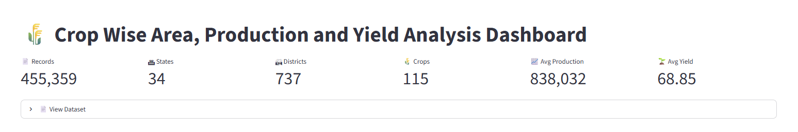
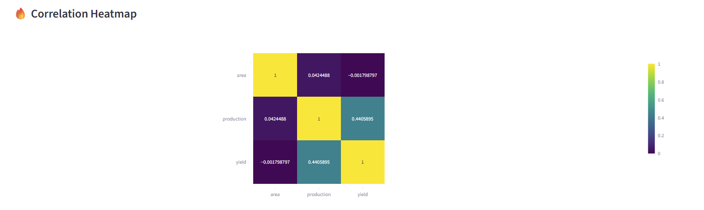
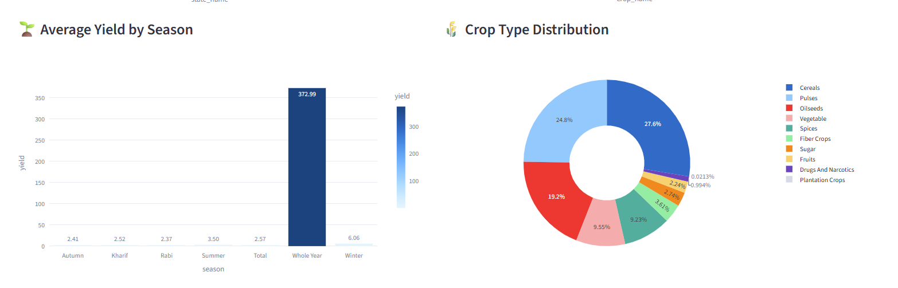

# 🌾 Crop Wise Area Production Yield Analysis

## 📑 Table of Contents

- Overview
- Dataset
- Project Objectives
- Technologies Used
- Dashboard
- Key Findings
- Folder Structure
- Installation
- Future Improvements
- 
## Overview

This project analyzes agricultural production patterns across India using a crop-wise dataset containing over 455,000 records. The analysis includes exploratory data analysis (EDA), interactive visualizations, and a Streamlit dashboard to identify production trends, yield performance, seasonal variations, and regional differences.

## Dataset

* Dataset: Crop Wise Area Production Yield
* Rows: 455,359
* Columns: 16
* Type: Structured CSV Data

## Objective

The objective of this project is to explore agricultural trends, crop production patterns, yield performance, and regional variations using data analytics techniques.

  
## Technologies Used

| Tool       | Purpose            |
| ---------- | ------------------ |
| Python     | Programming        |
| Pandas     | Data Cleaning      |
| NumPy      | Numerical Analysis |
| Plotly     | Interactive Charts |
| Streamlit  | Dashboard          |
| Matplotlib | Visualization      |
| Seaborn    | EDA                |

## Dashboard

![prod and yield(prod%and%yield.png)

## Project Status

Data collection and repository setup completed. Analysis and visualizations will be added in upcoming updates.
